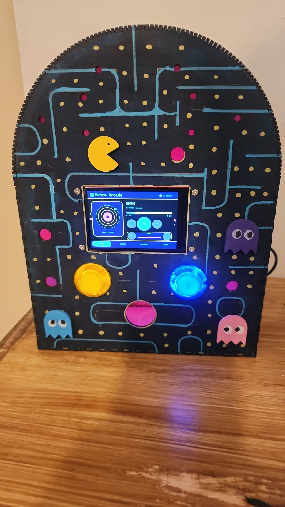
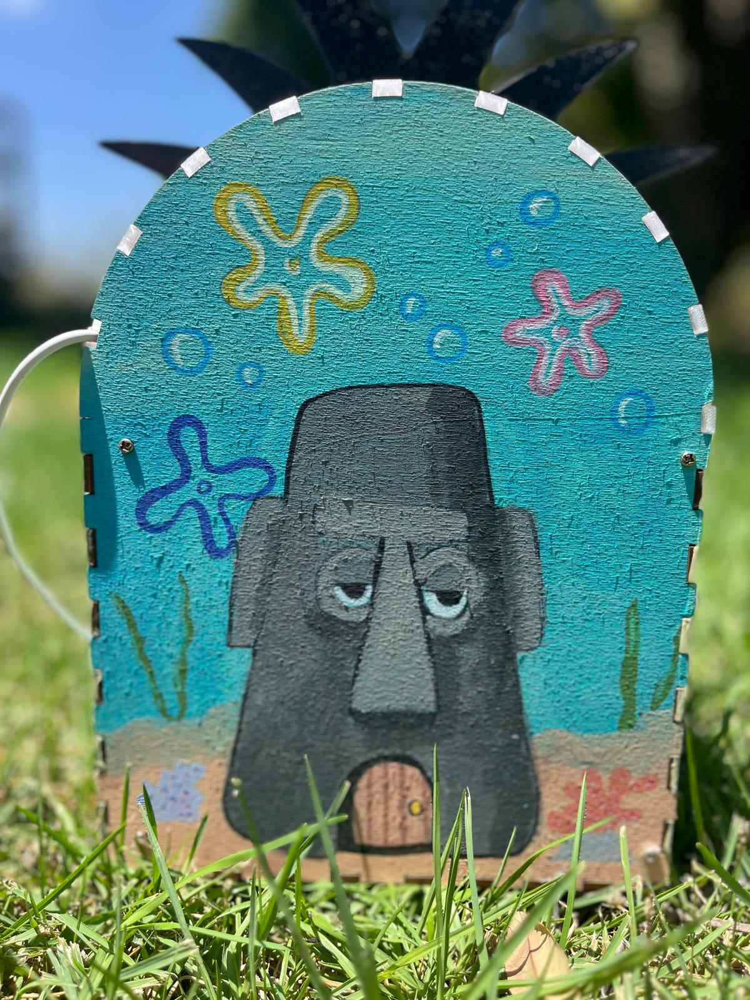
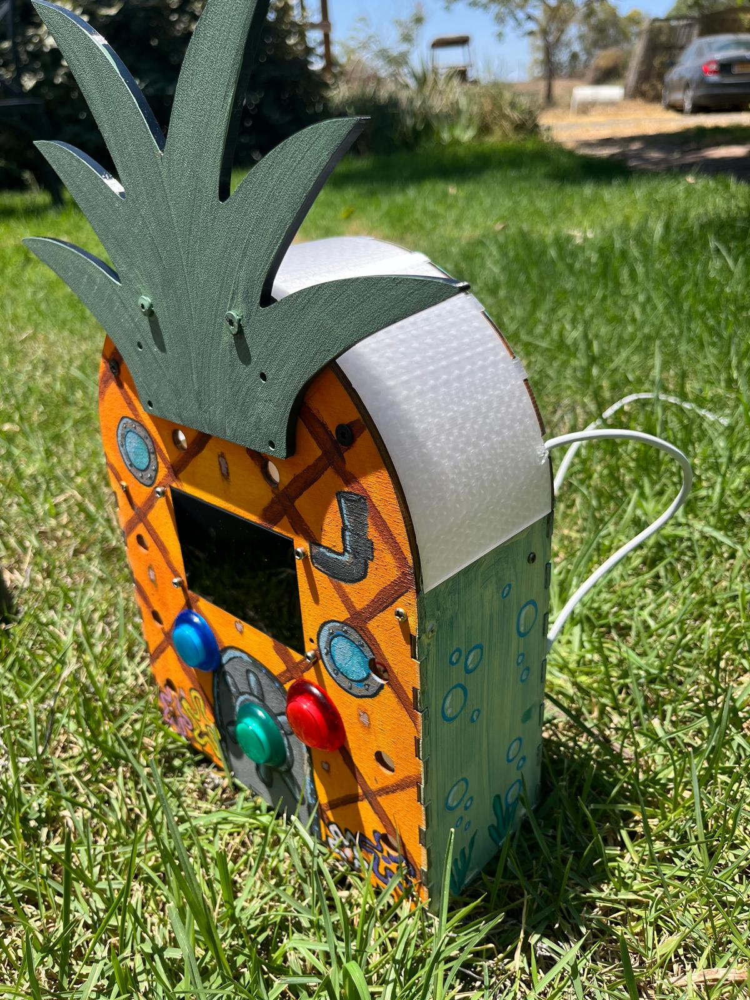
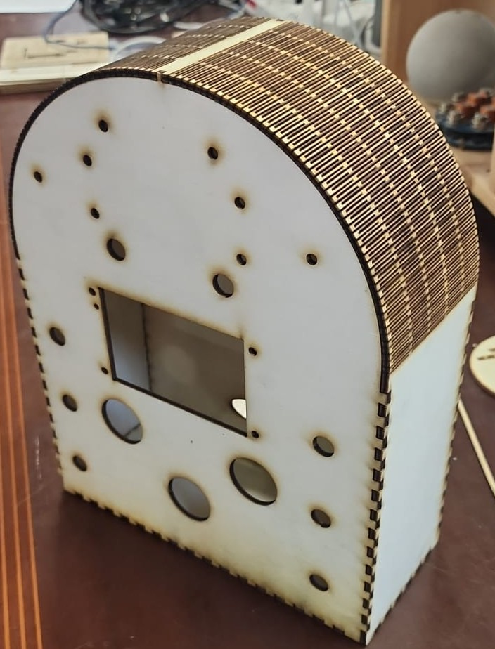
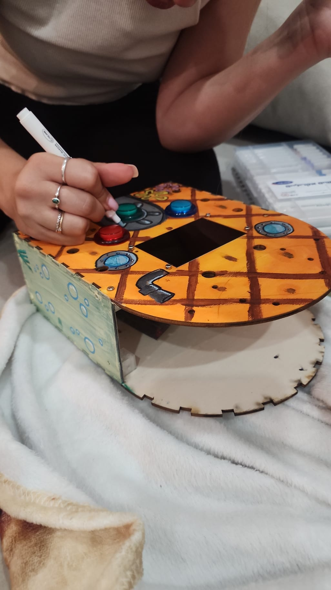

# Juckbox

An open-source, standalone touchscreen jukebox built on an ESP32-S3. No WiFi, no phone, no router — everything is controlled directly on the device's touchscreen: browse songs from a microSD card, play them through a real I2S audio path, pick from 12 UI themes, and play a couple of built-in games (Pinball, Air Hockey) without interrupting the music.

This repository is the open-source release of the project: firmware, enclosure/cutting files, and a full bill of materials, so anyone can build their own.

## Repository layout

| Folder | Contents |
|---|---|
| [`firmware/`](firmware) | PlatformIO project — main ESP32-S3 firmware (display, touch, audio, songs, themes, games). Start here — see [firmware/README.md](firmware/README.md) for hardware pinout, build/flash instructions, and known limitations. |
| [`hardware/enclosure/`](hardware/enclosure) | 3D-printable/laser-cut enclosure files (`Cube.step`, `Cube.stl`, `jukebox.svg`) — base geometry generated with [Boxes.py](https://www.festi.info/boxes.py/), then modified |
| [`hardware/bom/`](hardware/bom) | Full bill of materials with AliExpress part links and prices — see [COMPONENTS.md](hardware/bom/COMPONENTS.md) for a plain-text version |
| [`extras/simon-says/`](extras/simon-says) | Standalone Simon Says PlatformIO project, a smaller side project built alongside the jukebox |
| [`design/`](design) | Concept art and case-design references used while designing the enclosure |
| [`ui-mockups/`](ui-mockups) | Standalone HTML previews of UI/theme mockups |
| [`media/`](media) | Photos and a demo video of finished builds |

## Gallery

*Pac-Man theme, running*

*Squidward's house theme*

*Pineapple theme, in progress*

*Raw laser-cut enclosure*

*Painting at a build workshop*

### Demo video

*(GitHub doesn't inline-embed video committed to a repo — click the image above, or go straight to [`media/demo.mp4`](media/demo.mp4), and GitHub's file viewer will play it.)*

## Getting started

1. Read [firmware/README.md](firmware/README.md) for the full hardware spec (ESP32-S3 module, display, touch, audio codec, SD card) and pin configuration.
2. Check [hardware/bom/](hardware/bom) for what to buy.
3. Print/cut the enclosure from [hardware/enclosure/](hardware/enclosure).
4. Build and flash the firmware with [PlatformIO](https://platformio.org/) — see the firmware README for exact steps.

## Affiliate Disclosure

Some purchase links in the [BOM](hardware/bom) may be AliExpress affiliate links (marked **Affiliate**). If you buy through a marked link, the project maintainer may receive a small commission at no additional cost to you. Affiliate links never change which component is recommended, and using them is entirely optional — every part in the BOM also lists its plain specification so you can search and buy it independently. See [hardware/bom/README.md](hardware/bom/README.md) for details.

## License

Licensed under the [GNU General Public License v3.0](LICENSE).
